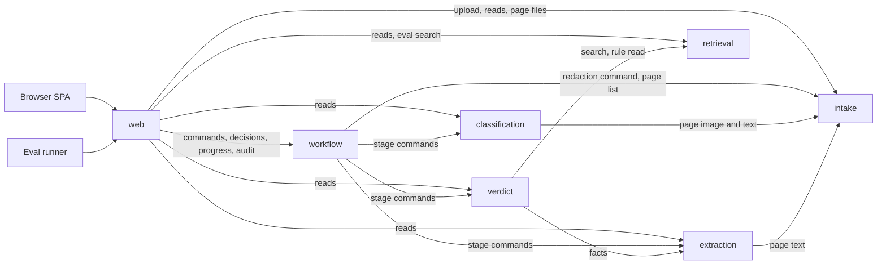
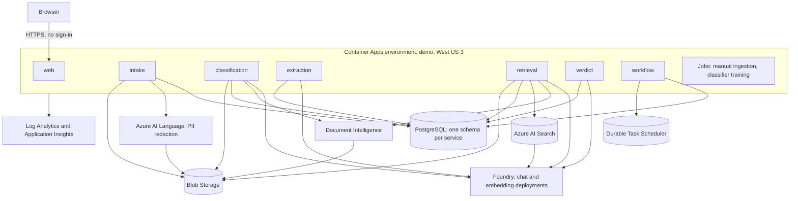
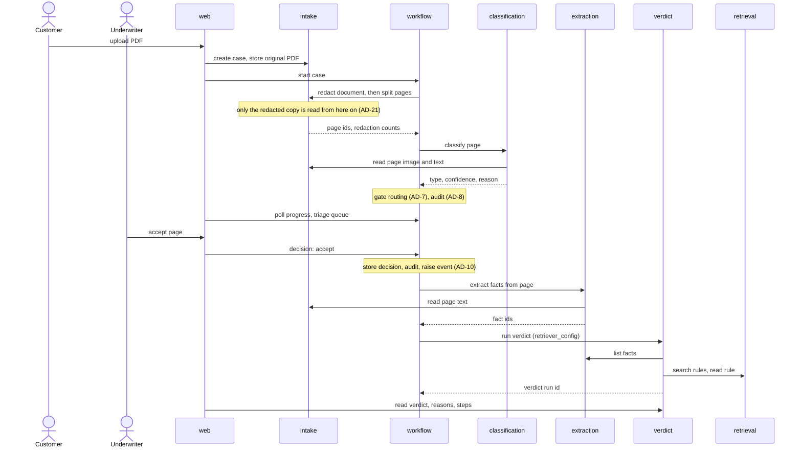
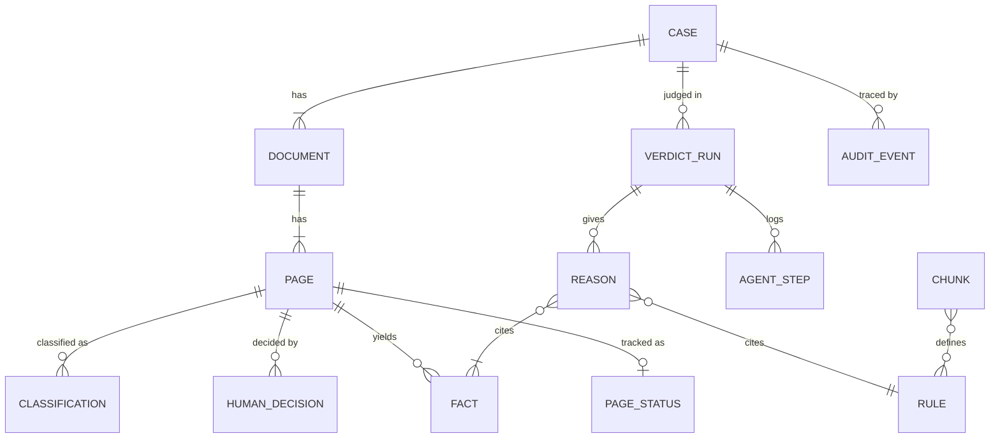

# Architecture Spine — AI Medical Underwriting Assistant POC

## Design Paradigm

**Orchestrated pipeline of stage services.** Each pipeline stage is its own service; one workflow service sequences them. Inside every service the layout is **hexagonal**: a framework-free domain package, with adapters around it.

| Service (Dapr app id) | Stage | Source folder |
| --- | --- | --- |
| `web` | SPA host and the only API entry | `services/web/` |
| `intake` | Upload, PII redaction, page split, page text and boxes, page files | `services/intake/` |
| `classification` | Page classification, both classifier contenders | `services/classification/` |
| `extraction` | Facts with page and quote, quote check | `services/extraction/` |
| `retrieval` | Manual ingestion and the search operation, all ladder rows | `services/retrieval/` |
| `verdict` | The agent that searches and suggests a verdict | `services/verdict/` |
| `workflow` | Case lifecycle, gate routing, human decisions, audit trail | `services/workflow/` |

Inside each Python service: `domain/` (pure, no framework imports), `adapters/` (HTTP routes, database, Azure clients, Dapr calls), `settings.py` (the one settings object).

## Invariants & Rules



An arrow means "may call". Any call not drawn is forbidden. The Operations table lists every operation behind each arrow.

### AD-1 — One service per pipeline stage

- **Binds:** all
- **Prevents:** stages merging into one app, or one stage being split across two deployables.
- **Rule:** The seven services in the paradigm table are the complete set. Each is one container image, one Container App, one user-assigned managed identity and one Dapr app id. Adding or merging a service is an architecture change.

### AD-2 — Only the workflow service sequences stages

- **Binds:** CAP-1, CAP-2, CAP-3, CAP-4, CAP-5, CAP-6, CAP-10
- **Prevents:** a stage triggering the next stage itself, so the gate or triage wait can be bypassed.
- **Rule:** A stage service changes state only when `workflow` commands it. Stage services never call the next stage; they call other services only to read, along the arrows above. Three writes do not come from `workflow`, and there are no others:
  1. **Upload:** `web` calls `intake` to create the case and store the PDF, then asks `workflow` to start that case.
  2. **Manual ingestion:** a one-off Container Apps job running the `retrieval` image and identity (AD-12).
  3. **Classifier training:** a one-off Container Apps job running the `classification` image and identity (AD-13).

  Both jobs are idempotent, are started by the deploy pipeline, and call no other service.

### AD-3 — Every service-to-service call goes through Dapr service invocation

- **Binds:** all services
- **Prevents:** a mix of direct URLs, SDK clients and sidecar calls between services.
- **Rule:** Calls between services are HTTP through the local Dapr sidecar, addressed by Dapr app id, made with `httpx` from one client module per service. Bodies are JSON, except page files and thumbnails from `intake`, which are binary. No service holds another service's hostname. An upload is at most 10 MB (the redaction service's limit), and the sidecars of `web` and `intake` raise Dapr's request size limit (4 MB by default) to 16 MB. No Dapr SDK package, Dapr state store, Dapr pub/sub or Dapr Workflow is used.

### AD-4 — One database, one schema per service, API-only access

- **Binds:** all services
- **Prevents:** two services writing the same entity, and hidden coupling through shared tables.
- **Rule:** One PostgreSQL database holds one schema per service, named after its app id. Each service's database role has rights only on its own schema; the database enforces it. A service gets another service's data only through that owner's API. `web` owns no schema. No cross-schema grants, views or foreign keys; cross-service references are plain id columns.

| Data | Owner |
| --- | --- |
| Cases, documents, pages, page text and word boxes; original PDFs (Blob container `originals`); redacted PDFs and page thumbnails (Blob container `cases`) | `intake` |
| Page classifications; classifier training files (Blob container `classifier-training`) | `classification` |
| Facts, quote-check results | `extraction` |
| Manual chunks, embeddings, both search indexes, the manual PDF (Blob container `manual`) | `retrieval` |
| Verdict runs, reasons, agent step log | `verdict` |
| Case and page status, human decisions, audit trail | `workflow` |

### AD-5 — The case lifecycle runs on Azure Durable Task Scheduler

- **Binds:** `workflow`; CAP-1, CAP-2, CAP-3
- **Prevents:** lifecycle logic spread over services, or a second engine appearing beside the first.
- **Rule:** `workflow` runs one orchestration per case on Durable Task Scheduler (Consumption SKU) with `durabletask-azuremanaged`. The orchestration instance id is the `case_id`. Orchestrator code holds only sequencing and gate routing; each activity is one call to a stage service. Human waits are external events, never polling loops or timers. A verdict run requested after the case finished (AD-11) is its own orchestration, with instance id `<case_id>:verdict:<retriever_config>`. Dapr Workflow is not used: it is unsupported on Azure Container Apps.

### AD-6 — Stage commands block, are idempotent, and carry ids, not content

- **Binds:** `workflow` and every stage service
- **Prevents:** duplicate facts or verdicts when an activity retries, a second run starting while the first is in flight, and payloads that outgrow the engine's 1 MB limit.
- **Rule:**
  - **Key:** every stage command has the idempotency key shown in the Operations table. Repeating a command with the same key returns the stored result and writes nothing new.
  - **In flight:** the stage inserts its key row with status `running` before doing any work. A repeat while `running` returns 409 with code `in_progress`, and `workflow` retries with backoff.
  - **Call style:** commands block until the result is stored. A stage enforces its own deadline of 180 seconds and then stores a `failed` result; `workflow`'s activity timeout is 200 seconds.
  - **Payloads:** commands and results carry ids and small summaries only; a stage reads the content it needs from the owner's API.

### AD-7 — Gate routing is decided in one place

- **Binds:** CAP-2, CAP-3; `workflow`, `classification`
- **Prevents:** the 90% threshold or the routing table being copied into the classifier, the SPA or prompts.
- **Rule:** `classification` returns `page_type`, `is_medical`, `confidence` and `reason`, and never routes. The routing table in `flows.md` and its threshold live only in `workflow`'s domain package; the threshold is a setting with default `0.90`. A case is routed on the result of the one `classifier_contender` it was started with. The SPA displays routes and never computes them.

### AD-8 — One audit trail, written only by the workflow service

- **Binds:** CAP-10; all services
- **Prevents:** per-service audit shapes, and a trail that disagrees with the lifecycle.
- **Rule:** `workflow.audit_event` is the only audit table. It is append-only: no code path updates or deletes a row. Every stage result and every human decision carries one audit record in the shape below, and `workflow` writes it in the same transaction as the status change it reports. A row is unique on `case_id`, `page_id` (null counts as one value), `action` and `ref`, so a retried activity inserts nothing. The verdict agent's inner steps stay in `verdict.agent_step`; the audit event for a verdict run references that run so the trail drills down into them.

| Field | Content |
| --- | --- |
| `actor_kind` | `human` or `ai` |
| `actor` | Demo role (`customer`, `underwriter`) for a human; service app id plus model deployment name for AI (for redaction, `intake` plus `azure-ai-language`) |
| `action` | One of the catalogue in the contracts package (`document.redacted`, `page.classified`, `page.kept`, `page.discarded`, `page.accepted`, `page.denied`, `facts.extracted`, `verdict.suggested`, `stage.failed`) |
| `occurred_at` | ISO 8601 UTC, set by the service that did the work |
| `case_id`, `page_id` | Subject; `page_id` null for case-level actions |
| `ref` | Id of the owning record (classification, fact set, verdict run, human decision) |
| `detail` | Small JSON summary; for `document.redacted`, a map of category to count; otherwise null |
| `trace_id` | W3C trace id of the request |
| `eval_run_id` | Set when the case belongs to a bake-off run, otherwise null |

### AD-9 — No sign-in: two demo roles from a role switcher, fully open

- **Binds:** `web`, SPA; CAP-3, CAP-10
- **Prevents:** half-built authentication, or services inventing their own notion of who is acting.
- **Rule:** There is no sign-in and no user record. The SPA's role switcher sends `X-Demo-Role: customer | underwriter` on every API call; `web` rejects any other value with 400 and checks the role each route needs. `web` passes the role as the human `actor` to `workflow`; internal services trust it and never read the header themselves. Every case is visible to both roles; there is no owner scoping and no row-level security. This overrides the spec's Entra sign-in constraint and the standards rules listed under Accepted exceptions.

### AD-10 — Human-reserved actions come only from a human role, through `web` to `workflow`

- **Binds:** CAP-3, CAP-6; `web`, `workflow`, `verdict`
- **Prevents:** the AI or a stage service accepting, denying, discarding or deciding.
- **Rule:** Keep, discard, accept and deny are one `workflow` operation, reachable only from `web`. `workflow` stores the decision, writes its audit row and raises the external event on the orchestration; nothing else raises that event. Its domain rejects a decision unless `actor_kind` is `human`, and returns 409 for a page that is not awaiting that decision. No agent tool and no stage API exposes these actions. A verdict is always a suggestion: the verdict payload and the result screen carry the exact label "AI suggestion, not a decision", and no service stores a final decision.

### AD-11 — One retrieval interface; the ladder rows are named configurations

- **Binds:** CAP-5, CAP-8; `retrieval`, `verdict`, `workflow`
- **Prevents:** a contender getting its own endpoint, result shape or chunks, which would make the bake-off unfair.
- **Rule:** `retrieval` exposes one search operation: a query, a `retriever_config` and `top_k` (default 5) in; `retriever_config`, `latency_ms` and a ranked `items` list out. Each item carries `chunk_id`, `rule_ids`, `rank`, `score`, `text`, `manual_page` and `impairment`. Each ladder row is one named `retriever_config`. A case is started with a list of `retriever_configs` (default: one, from a setting) and gets one verdict run per entry, all on the same extracted facts. The Compare toggle requests one more verdict run for a finished case through `workflow`; its pair is a setting, default `r4` and `r5`.

| `retriever_config` | Store | Chunk set | Method |
| --- | --- | --- | --- |
| `r1` | pgvector | `fixed` | Vector only |
| `r2` | pgvector | `smart` | Vector only |
| `r3` | pgvector | `smart` | Hybrid: vector + PostgreSQL full-text, fused with RRF |
| `r4` | pgvector | `smart` | `r3` + reranker |
| `r5` | Azure AI Search | `smart` | Hybrid + semantic ranker |
| `r6` | Azure AI Search | `smart` | Agentic retrieval (knowledge base with LLM query planning) |

Row `r6` needs Azure AI Search's preview API (`2026-08-01-preview`): the stable API offers only extractive retrieval without the LLM. `retrieval` therefore pins the pre-release `azure-search-documents` 12.1.0b2, the only pre-release package this architecture allows.

### AD-12 — One ingestion produces the chunks and vectors for both stores

- **Binds:** CAP-5, CAP-8, CAP-11; `retrieval`
- **Prevents:** pgvector and Azure AI Search indexing different text or different vectors, and cross-references inflating recall.
- **Rule:** The ingestion job parses the manual PDF with Document Intelligence's layout model, once per chunk set (`fixed`, `smart`), and loads the same chunk records and the same embedding vectors into both stores. `chunk_id` is stable and identical in both. A chunk's `rule_ids` are only the rules defined in its text span, never rules it merely refers to. The manual prints each definition as `Rule <rule_id>:` and a `rule_id` matches `UW-[A-Z]{2,4}-[0-9]{3}`; both patterns live in the contracts package. A `smart` chunk holds exactly one rule, its parent section id and an LLM-written context line. Vectors are `text-embedding-3-large` at 3,072 dimensions, searched with exact nearest-neighbour in both stores (no approximate index). The answer key is never indexed and never readable by any service.

### AD-13 — One classifier interface; the contender is chosen per case

- **Binds:** CAP-2, CAP-9; `classification`, `workflow`
- **Prevents:** the two classifiers returning different shapes, or a second contender being handed the first one's stored result.
- **Rule:** Both contenders (`llm`, `doc-intelligence`) sit behind one classifier interface and return `page_type`, `is_medical`, `confidence` (0 to 1), `reason` and `contender`. `page_type` is one of `lab_report`, `attending_physician_statement`, `application_form`, `id_document`, `invoice`, `other`; `is_medical` is true for the first three, by one mapping in the contracts package. A case is started with one `classifier_contender` (default from a setting), and it is part of the classify command's key. The LLM contender's confidence is the agreement rate across repeated runs. The Document Intelligence contender is trained by the training job from `data/classifier-training/`, a page set disjoint from the scored page set, with at least five pages per `page_type`. Both contenders are always given one page at a time, as a one-page document. Training pages pass through the same redaction as case pages before training, so the classifier is trained and scored on the same kind of page.

### AD-14 — One reading of each page, owned by intake

- **Binds:** CAP-4, CAP-7; `intake`, `extraction`, SPA
- **Prevents:** extraction, the quote check and the PDF highlight each using a different reading of the page.
- **Rule:** `intake` produces the one stored text per page from the redacted PDF (AD-21), with a box for every word, and a thumbnail image. `extraction` reads only that text, and its domain code marks a fact `quote_verified` only when the normalised quote is found in the normalised page text. Normalisation is one function in the contracts package. An unverified fact is stored and flagged, never dropped and never shown as verified. A fact carries `fact_id`, `page_id`, `page_number` (1-based), `quote`, `quote_verified` and, when verified, `quote_start` and `quote_end` offsets into the page text. Mask tokens such as `[Person]` are part of the page text: normalisation keeps them, a quote may contain them, and a masked value is never extracted as a fact. The SPA highlights by drawing the boxes `intake` returns for that offset range; it never searches the browser's own text layer.

### AD-15 — The verdict agent has exactly three tools and writes only its own run

- **Binds:** CAP-5, CAP-6; `verdict`
- **Prevents:** tool creep, an agent that reads or writes outside its task, and reasons with no evidence behind them.
- **Rule:**
  - **Tools:** the agent is built with Microsoft Agent Framework inside `verdict`. Its tools are `list_facts` (the case is fixed by the server), `search_rules` (free query text plus the `fact_id` it is about; `retriever_config` fixed by the server) and `read_rule`. `read_rule` accepts only a `rule_id` returned by a search, or referred to in a rule already read, in the same run; it returns that rule's text from the run's chunk set.
  - **Row `r6`:** the agent's search loop is replaced by one retrieval request per fact; the verdict is composed from what returns.
  - **Log and stop:** every tool call is appended to `verdict.agent_step` with `verdict_run_id`, `case_id`, `step_no`, `tool`, `arguments`, `fact_id`, `rule_ids` (those returned or read), `latency_ms` and `occurred_at`. The table is append-only. A run stops at a configured step limit.
  - **Query:** the agent log is readable by run, and by case with optional `tool` and `rule_id` filters. Querying it is a step in the demo script.
  - **Run identity:** a verdict run is keyed by `case_id` and `retriever_config`.
  - **Output:** `verdict`, `loading_pct` (null unless `loaded`), `confidence`, `reasons` and `system_reasons`. A reason carries `rule_id`, `fact_ids`, `effect` (`none`, `debit`, `decline`) and `debit_pct`, and is stored only if every id was seen in that run. `system_reasons` are codes that need no citation: `no_matching_rule`, `conflicting_rules`, `unverified_quote`, `low_confidence`, `step_limit`.
  - **Domain rules, not prompt:** `verdict`'s domain code sets `refer` whenever a system reason is present, sets `low_confidence` when `confidence` is under a setting (default `0.70`), and computes `loading_pct` as the sum of the cited `debit_pct` values.

### AD-16 — One LLM deployment and one embedding deployment for everything

- **Binds:** CAP-8, CAP-9; all AI-calling services
- **Prevents:** contenders or stages quietly using different models, which breaks bake-off fairness.
- **Rule:** All services use the same chat model deployment and the same embedding deployment on one Foundry account, reached with managed identity. Deployment names reach code only as settings. Each deployment is pinned to an exact model version with auto-upgrade off and the default content filter. Prompts live in the owning service's `prompts/` folder under version control. Each service calls the model through one gateway module, which retries a 429 or 5xx up to three times, honouring `Retry-After`, then raises `model_unavailable`.

### AD-17 — Bake-off scores come from one runner and are published as files

- **Binds:** CAP-8, CAP-9, CAP-11, CAP-12
- **Prevents:** scoreboards computed differently per contender, numbers typed in by hand, and an open endpoint that accepts scores.
- **Rule:**
  - **Answer key:** the rule table, the expected facts, rules, verdicts and page labels, and the identifiers planted in each case live in `data/answer-key/` and are read only by the runner in `evals/`.
  - **Runner:** it drives the deployed pipeline through `web`'s API with an `eval_run_id` on every case it starts. Cases with an `eval_run_id` are hidden from the triage queue.
  - **Retrieval recall and latency:** one eval search per expected fact per `retriever_config`, with the query built by one function in the contracts package. A fact is a hit when its expected `rule_id` is in the top 5.
  - **Verdict accuracy:** each case is uploaded once and started with all six `retriever_configs`; the runner answers the human waits through the decision operation, using the answer key's page labels.
  - **Classifier:** the scored page set is uploaded once per contender and started with `stop_after` set to `gate`.
  - **Redaction check:** the runner reads every page's text through `web` and fails the run if any planted identifier, or any part of a planted name, appears after the contracts normalisation. It also reports how many expected-fact quotes are no longer found, and writes `data/scoreboards/redaction.json`.
  - **Metrics:** exactly those in `bake-offs.md`. Cost and effort are declared inputs in `evals/static-metrics.yaml`, each with its source.
  - **Publishing:** the runner writes `data/scoreboards/retrieval.json` and `data/scoreboards/classification.json`. `web` serves them read-only; no service stores scores.
  - **Winner:** retrieval is won on verdict accuracy, then rule recall, then latency. Classification is won on accuracy among contenders whose calibration is at least 0.90, then on the lower queue rate.

### AD-18 — One environment, one region, one way in

- **Binds:** all infrastructure
- **Prevents:** environment or region drift, and a stage reachable around the workflow.
- **Rule:** There is exactly one environment, `demo`, in West US 3 (`westus3`, short code `wus3`); every resource is in that region. The workload short name is `aiuw`. Only `web` has external ingress; the other six services have internal ingress only. PostgreSQL, Blob Storage, Azure AI Search, Foundry, Document Intelligence, Azure AI Language and Durable Task Scheduler use public endpoints with key and password access disabled and managed identity only. Terraform has two stacks, applied in this order: `foundation` then `app`.

### AD-19 — The SPA and API share one origin, and the SPA reads by polling

- **Binds:** `web`, SPA; CAP-1, CAP-7
- **Prevents:** CORS, a second public entry point, or a push channel only some screens use.
- **Rule:** `web` serves the built SPA and every `/api/*` route from one origin; CORS stays off. `web` assembles each screen by calling the owning services and holds no business rules. The SPA calls `/api/*` only through its one API client module and shows progress by polling; there are no WebSockets or server-sent events.

### AD-20 — The contracts package is built first and is the only shared code

- **Binds:** all services
- **Prevents:** seven builders each inventing payload shapes, paths and codes for the same call.
- **Rule:** `packages/contracts/` holds a pydantic model for every request and response in the Operations table, the audit record, the enums, the error codes, the `rule_id` patterns, the `page_type` mapping, the eval query builder and the text normalisation function. It is built and frozen as the first epic, before any service. A change to it is one pull request that updates every affected service. No service imports another service's code.

### AD-21 — PII is redacted first, and only the redacted copy is ever read

- **Binds:** CAP-12; `intake`, `workflow`, all later stages
- **Prevents:** a stage, a model call or a screen reading personal identifiers, and two copies of a document being used for different purposes.
- **Rule:** Redaction is the first stage `workflow` commands, and `intake` performs it by calling Azure AI Language's document-based PII redaction with the entity mask. The original PDF is stored in Blob container `originals`; no API serves it and no other stage reads it. The redacted PDF is the document of record: page split, page text, word boxes, thumbnails, classification, extraction, verdict and the PDF viewer all use it. The redacted categories are a setting, by default person names, addresses, phone numbers, email addresses, and identity and policy numbers; dates (including date of birth), ages and medical terms are kept. The original is the only place the redacted identifiers exist, so it is the only store marked sensitive. Redacted files and the service's result file sit in `cases` under the prefix `<case_id>/`. `workflow` writes a `document.redacted` audit event with the count of items redacted per category, taken from the service's result by its category names, never their values. If redaction fails or passes its deadline, `intake` cancels the Language job and creates no pages, and `workflow` ends the case as `failed` with a case-level `stage.failed` event; the original is never used instead, and the customer uploads again. The eval runner checks the result (AD-17).

## Operations

Paths are on the owning service; `web` exposes the same resources under `/api`. "Key" is the idempotency key of AD-6.

| Caller → owner | Operation | Key or note |
| --- | --- | --- |
| `web` → `intake` | `POST /cases` (PDF in; `case_id`, `document_id` out) | Stores the original only |
| `workflow` → `intake` | `POST /cases/<case_id>/redaction` | Key `case_id`; redacts, then splits pages and stores text, boxes and thumbnails; returns the page ids and the redaction counts |
| any reader → `intake` | `GET /cases/<case_id>/pages`, `GET /pages/<page_id>/text`, `GET /pages/<page_id>/boxes`, `GET /pages/<page_id>/thumbnail`, `GET /documents/<document_id>/file` | Thumbnail is PNG; file is the redacted PDF. Until redaction is done the page list is empty and the file returns 409 with code `not_redacted` |
| `web` → `workflow` | `POST /cases/<case_id>/start` with `classifier_contender`, `retriever_configs`, `stop_after`, `eval_run_id` | Key `case_id`; all fields optional |
| `web` → `workflow` | `POST /cases/<case_id>/pages/<page_id>/decisions` with `decision`, `actor` | 409 if the page awaits no such decision |
| `web` → `workflow` | `POST /cases/<case_id>/verdict-runs` with `retriever_config` | Key `case_id` + `retriever_config`; 409 until every page is terminal |
| `web` → `workflow` | `GET /cases/<case_id>/progress`, `GET /cases/<case_id>/audit`, `GET /pages?status=` | Progress carries the case status and the redaction stage status beside the page list, which is empty until redaction is done. The last operation is the cross-case triage queue |
| `workflow` → `classification` | `POST /classifications` | Key `case_id` + `page_id` + `contender` |
| `workflow` → `extraction` | `POST /fact-sets` | Key `case_id` + `page_id` |
| `workflow` → `verdict` | `POST /verdict-runs` | Key `case_id` + `retriever_config` |
| `web` → `classification` | `GET /cases/<case_id>/classifications` | |
| `web`, `verdict` → `extraction` | `GET /cases/<case_id>/facts` | |
| `web` → `verdict` | `GET /cases/<case_id>/verdict-runs`, `GET /verdict-runs/<verdict_run_id>/steps`, `GET /cases/<case_id>/agent-steps?tool=&rule_id=` | The last two are the agent log |
| `verdict`, `web` → `retrieval` | `POST /searches` | Not stored; no key |
| `verdict`, `web` → `retrieval` | `GET /rules/<rule_id>?retriever_config=` | The SPA's rule view omits the parameter and gets the `smart` chunk |

## Consistency Conventions

| Concern | Convention |
| --- | --- |
| Ids | `case_id`, `document_id`, `page_id`, `fact_id`, `verdict_run_id`, `eval_run_id`: UUIDv7 strings, generated by the owner (`eval_run_id` by the runner). `rule_id` is the id printed in the manual. `chunk_id` is assigned at ingestion. |
| Enums | Verdict: `standard`, `loaded`, `decline`, `refer`. Page status: `uploaded`, `classified`, `awaiting_customer`, `awaiting_triage`, `extracting`, `extracted`, `discarded`, `denied`, `failed`. Case status: `running`, `awaiting_human`, `completed`, `failed`. Stage result status: `running`, `done`, `failed`. Decision: `keep`, `discard`, `accept`, `deny`. Demo role: `customer`, `underwriter`. |
| Numbers | Confidence and scores are floats from 0 to 1 on the wire and in the database; the SPA formats percentages. A loading or debit is an integer percentage (50 means +50%). |
| Dates | Timestamps are ISO 8601 UTC. |
| JSON | `snake_case` field names; the same field name in the database, the API and the SPA. |
| Errors | `{"error": {"code", "message", "trace_id"}}` from every service. Codes come from the catalogue in the contracts package. No stack traces, SQL or paths. |
| Database | Table and column names in `snake_case`, singular table names. One Alembic environment per service, with its version table in the service's own schema. Migrations run from the pipeline, never at startup. |
| Database roles | One Entra-mapped role per service identity, with data rights on its own schema only. The pipeline's migration role owns the schemas. |
| Configuration | One `pydantic-settings` object per service; environment variables prefixed with the app id in upper case (`RETRIEVAL_`, `WORKFLOW_`). |
| Tracing and logs | OpenTelemetry in every service to the one Application Insights instance; the W3C trace context is passed on every Dapr call. Model calls and database calls are not traced automatically, so each service's model gateway and database adapter open their own spans. Logs carry ids, codes and timings, never page text, quotes or fact values. |
| AI output | Every model response is parsed into a pydantic model from the contracts package; a response that fails validation is an error, never passed on. |
| Tests | Unit tests use fakes for Azure, the model and other services. Each service has a gateway stub for the model. Coverage thresholds are 80% for services and 60% for the SPA; the eval set, not coverage, checks AI behaviour. |

## Stack

| Name | Version |
| --- | --- |
| Python | 3.13 |
| fastapi | 0.142.2 |
| uvicorn | 0.54.0 |
| pydantic | 2.13.5 |
| pydantic-settings | 2.15.0 |
| httpx | 0.28.1 |
| sqlalchemy | 2.1.3 |
| alembic | 1.20.0 |
| psycopg | 3.3.6 |
| pgvector (Python) | 0.5.0 |
| openai | 3.24.0 |
| agent-framework-core | 1.20.0 |
| agent-framework-openai | 1.15.0 |
| durabletask-azuremanaged | 1.11.0 |
| azure-identity | 1.26.0 |
| azure-storage-blob | 12.31.0 |
| azure-search-documents | 12.1.0b2 (pre-release, for `r6`) |
| azure-ai-documentintelligence | 1.0.2 |
| azure-monitor-opentelemetry | 1.8.10 |
| pymupdf | 1.28.2 |
| Node.js | 24.21.0 |
| TypeScript | 6.0.3 |
| typescript-eslint | 8.71.1 |
| react | 19.3.0 |
| vite | 8.3.3 |
| react-pdf | 11.0.0 |
| vitest | 5.0.3 |
| Azure Container Apps | Consumption profile, managed Dapr (service invocation only) |
| Azure Database for PostgreSQL | Flexible Server, Burstable B1ms, `vector` extension 0.8.2 |
| Azure AI Search | Basic |
| Azure Durable Task Scheduler | Consumption SKU |
| Azure AI Document Intelligence | S0 |
| Azure AI Language | S tier, single-service resource; document PII over REST |
| Microsoft Foundry models | `gpt-5.4` (2026-03-05), `text-embedding-3-large` |

## Structural Seed

### Deployment



| Stack | Resources |
| --- | --- |
| `foundation` | Resource group (adopted), Log Analytics, Application Insights, container registry, Container Apps environment, PostgreSQL server and database (with `vector` allow-listed), Storage account and its four containers, Foundry account, project and deployments, Azure AI Search, Document Intelligence, Azure AI Language, Durable Task Scheduler and task hub, the seven runtime identities, budget and alerts |
| `app` | The seven Container Apps with their Dapr settings and ingress, the two Container Apps jobs, and the runtime role assignments |

Runtime identities hold only these data-plane roles, each scoped to the one resource:

| Identity | Roles |
| --- | --- |
| all seven | AcrPull on the registry; Monitoring Metrics Publisher on Application Insights |
| all except `web` | Their own PostgreSQL role (AD-4) |
| `intake` | Storage Blob Data Contributor on containers `originals` and `cases`; Cognitive Services User on Azure AI Language |
| `classification` | Foundry User; Cognitive Services User on Document Intelligence; Storage Blob Data Contributor on container `classifier-training` |
| `extraction`, `verdict` | Foundry User |
| `retrieval` | Foundry User; Search Index Data Contributor and Search Service Contributor on Azure AI Search; Cognitive Services User on Document Intelligence; Storage Blob Data Contributor on container `manual` |
| `workflow` | Durable Task Data Contributor on the task hub |
| Azure AI Search's own identity | Cognitive Services User on the Foundry account (for `r6`) |
| Azure AI Language's own identity | Storage Blob Data Reader on container `originals`; Storage Blob Data Contributor on container `cases` |
| Document Intelligence's own identity | Storage Blob Data Reader on containers `classifier-training` and `manual` |

Compute ceilings: each Container App runs at 0.5 vCPU and 1 GiB with at most 2 replicas. `workflow` keeps 1 replica so a case starts without a cold start (a scheduler-driven scale rule exists and is not used); the others scale to zero, with a `min_replicas` variable to hold them at 1 during the demo.

Local development runs the seven services with the Dapr CLI's multi-app run file, PostgreSQL with pgvector and the Durable Task Scheduler emulator in containers, and the `demo` environment's Foundry, Azure AI Search, Document Intelligence, Azure AI Language and Storage account through the developer's Azure sign-in.

Seeding the demo is three pipeline steps after deploy: the ingestion job, the training job, then the eval runner.

### One case, end to end



### Core entities



`CASE`, `DOCUMENT`, `PAGE` belong to `intake`; `CLASSIFICATION` to `classification`; `FACT` to `extraction`; `CHUNK` to `retrieval`; `VERDICT_RUN`, `REASON`, `AGENT_STEP` to `verdict`; `HUMAN_DECISION`, `AUDIT_EVENT`, `PAGE_STATUS` to `workflow`. `RULE` is the manual's `rule_id`, not a table. Lines that cross owners are id references only (AD-4).

### Source tree

```text
services/
  web/               # FastAPI entry and static SPA host
    spa/             # React SPA (src/api/ is the one API client)
  intake/
  classification/
  extraction/
  retrieval/
  verdict/
  workflow/
    <each>: domain/  adapters/  prompts/  migrations/  tests/  settings.py  Dockerfile
packages/
  contracts/         # shared payload models, enums, codes, patterns, normalisation
data/
  manual/            # synthetic manual source and PDF
  cases/             # synthetic case PDFs and the scored page set
  classifier-training/  # pages for training only, disjoint from the scored set
  answer-key/        # rule table and expected results; read only by evals/
  scoreboards/       # written by the runner, served by web
evals/               # bake-off runner and static-metrics.yaml
infra/
  bootstrap/
  modules/
  demo/
    foundation/
    app/
.github/workflows/
```

### Build order

1. `packages/contracts/` (AD-20) and the `foundation` stack.
2. The demo path: upload, redaction and on to a cited verdict, with `r3` and the `llm` classifier.
3. The bake-offs: the remaining ladder rows, the `doc-intelligence` contender, the runner and the scoreboards.

Scope cuts come from the end of step 3 first.

## Capability → Architecture Map

| Capability / Area | Lives in | Governed by |
| --- | --- | --- |
| CAP-1 Upload and per-page progress | `web`, `intake`, `workflow` (page status) | AD-2, AD-4, AD-19 |
| CAP-2 Classification gate | `classification`, `workflow` | AD-7, AD-13 |
| CAP-3 Underwriter triage | `web`, `workflow` | AD-7, AD-9, AD-10 |
| CAP-4 Fact extraction with quote check | `extraction`, `intake` | AD-14, AD-6 |
| CAP-5 Rule retrieval | `retrieval`, `verdict` | AD-11, AD-12, AD-15 |
| CAP-6 Suggested verdict | `verdict` | AD-10, AD-15 |
| CAP-7 Auditable result view | `web`, SPA, `intake` | AD-14, AD-19, AD-8 |
| CAP-8 Retrieval bake-off | `retrieval`, `verdict`, `evals/` | AD-11, AD-12, AD-16, AD-17 |
| CAP-9 Classifier bake-off | `classification`, `evals/` | AD-13, AD-16, AD-17 |
| CAP-10 Audit trail | `workflow` | AD-8, AD-9 |
| CAP-11 Synthetic data | `data/`, the ingestion and training jobs | AD-12, AD-13, AD-17 |
| CAP-12 PII redaction | `intake`, `workflow` | AD-21, AD-8, AD-14 |

## Assumptions

These were not chosen by Darrel. Each stands until corrected.

| Where | Assumption |
| --- | --- |
| AD-3 | Dapr is called over plain HTTP, with no Dapr SDK package. |
| AD-4, AD-10 | Human decisions and page status are owned by `workflow`. |
| AD-6 | Commands block, with the 180 and 200 second limits. |
| AD-11 | The Compare pair defaults to `r4` and `r5`. |
| AD-12 | Vectors are 3,072 dimensions with exact search; the `rule_id` pattern and definition marker. |
| AD-13 | `application_form` counts as medical. |
| AD-14 | Highlights are drawn from `intake`'s word boxes. |
| AD-15 | The three tools, the step limit, the `0.70` confidence floor, and loading as the sum of debits. |
| AD-17 | The runner drives the pipeline through `web`, scores are published as files, and the winner rules. |
| AD-18 | The workload short name `aiuw`, the two stacks, the compute ceilings, and `workflow` held at 1 replica. |
| AD-19 | The SPA polls. |
| AD-20 | One shared contracts package, built first. |

## Accepted exceptions

| Standard | Exception | Approved by | Close by |
| --- | --- | --- | --- |
| SPEC constraint "Entra sign-in with two demo accounts" | Replaced by AD-9 | Darrel (project owner), 2026-10-06 | Before real data or any audience beyond the demo |
| `azure.md` rule 12 | No sign-in at the edge or in the application (AD-9) | Darrel (project owner), 2026-10-06 | Same |
| `security.md` rules 4, 5, 7 | No signed-in principal, no ownership checks, no row-level security (AD-9) | Darrel (project owner), 2026-10-06 | Same |
| `security.md` rules 12, 18 | No per-turn credential and no per-user rate limit: there are no users (AD-9) | Darrel (project owner), 2026-10-06 | Same |
| `security.md` rule 15 | `read_rule` takes a `rule_id` chosen by the model, checked server-side against the run (AD-15) | Darrel (project owner), 2026-10-06 | Same |
| `security.md` rule 19 | No alert on AI writes; the audit trail and the queryable agent step log (AD-15) are the record | Darrel (project owner), 2026-10-06 | Same |
| `coding-style.md` rule 23 | The eval runner writes cases to the one deployed environment (AD-17) | Darrel (project owner), 2026-10-06 | A second environment exists |
| `security.md` rule 29 | One pre-release package, `azure-search-documents` 12.1.0b2, named here for `r6` (AD-11) | Darrel (project owner), 2026-10-06 | The stable SDK supports LLM query planning |
| `azure.md` service set | Azure AI Search, Document Intelligence, Azure AI Language, Durable Task Scheduler and a Storage account are added (AD-5, AD-11, AD-13, AD-18, AD-21) | Spec constraint; Darrel, 2026-10-06 | Not applicable |

Accepted risk: anyone who finds the public URL can upload PDFs and spend model tokens while the environment runs. The only bounds are the resource-group budget alerts, low model deployment capacity and the compute ceilings.

## Deferred

| Item | Why it can wait | Revisit when |
| --- | --- | --- |
| Sign-in, ownership checks, row-level security | Synthetic data, one demo | Before real data, or any audience beyond the demo |
| Private endpoints, VNet integration | Synthetic data only | Real data or compliance comes into scope |
| Key Vault | No application secret exists | A first secret is needed |
| Second environment | One demo | The POC continues past the demo |
| High availability, zone redundancy, backups beyond defaults | No uptime target | An uptime or recovery target is agreed |
| Terraform, provider and Azure Verified Module versions | Pinned when the code is written (`terraform.md` rule 9) | First infrastructure story |
| Reranker for `r4` (Cohere Rerank on Foundry or an LLM reranker) | Only `r4` depends on it | `r4` is built |
| Visual design and screen wording beyond the fixed label in AD-10 | No UX round has run | Before the SPA screens are built |
| Resetting demo data between rehearsals | Eval cases are already hidden from queues | Rehearsal cases clutter the screens |
| Jira keys in pull requests and TODOs | No Jira site yet | Jira is configured |

## Open questions

- No architecture principles were agreed: Darrel skipped Da Vinci's principles round, and `docs/architecture/architecture.md` does not exist.
- Foundry now lists newer chat models than `gpt-5.4`. Keep it, or move up before deployments are pinned?
- Which Foundry deployment type will `westus3` use? A Global Standard deployment processes data outside the region and needs a `security.md` rule 3 exception (allowed for synthetic data).
- Azure AI Language's document redaction: the overview names API version 2026-05-01 as generally available, the how-to samples still use a preview version. Confirm the version at build.
- Redaction does not process text inside embedded images, so a photographed ID pasted into a page could keep its identifiers. Accept for the POC, or keep such pages out of the case set?
- Will the redaction service mask a synthetic policy number, which is not a standard category? Test with the first synthetic case.
- The redacted text still holds dates of birth and health data, which `security.md` rule 2 asks to treat as sensitive. Darrel's decision is that only the redacted identifiers are marked sensitive; confirm that reading of rule 2.
- Does the redaction service's result file contain the text of what it found? If so it must be stored with the original, not in `cases`.
- Is Cohere Rerank deployable from a `westus3` Foundry account?
- Durable Task Scheduler's price: the price list and pricing page say USD 0.003 per action, the billing guide says per million actions. Budget on per action and confirm on the first invoice.
- Does a Dapr call wake a service that has scaled to zero cleanly? Not stated in the documentation; test early, and hold `min_replicas` at 1 if not.
