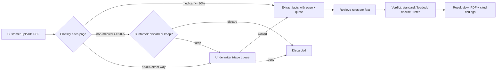

# Flows

## Pipeline

## Gate rules (CAP-2, CAP-3)

| Classifier result | Route |
| --- | --- |
| Medical, confidence ≥ 90% | Extraction |
| Non-medical, confidence ≥ 90% | Ask customer: discard (removed) or keep (triage queue) |
| Either label, confidence < 90% | Triage queue: underwriter accepts (extraction) or denies (removed) |

The customer prompt names the predicted type and confidence, e.g. "This looks like a utility bill (96%). Discard or keep?"

## Verdicts (CAP-6)

| Verdict | When |
| --- | --- |
| Standard | No rule triggers a debit |
| Loaded premium | Rules trigger debits; the suggested loading is shown (e.g. +50%) |
| Decline | A triggered rule says decline |
| Refer to underwriter | Low confidence, conflicting rules, unverified quotes on deciding facts, or no matching rule |

## Result view (CAP-7)

Two panes: the PDF on the left; on the right the verdict at the top, then reasons (each linking to its `rule_id`), then extracted facts (each citing page and quote). Selecting a citation scrolls the PDF to the page and highlights the quote.
